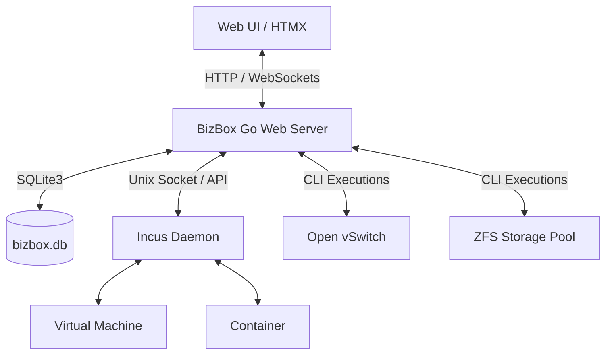

# BizBox Virtualization Hypervisor Blueprint

BizBox is a lightweight, self-hosted hypervisor and virtual machine manager designed for Debian/Ubuntu environments. It orchestrates Incus (LXD fork) for virtualization/containerization, Open vSwitch (OVS) for networking, and ZFS for rapid storage operations and snapshotting.

---

## 1. System Architecture



### Core Technologies
- **Backend**: Go (standard HTTP library + Gorilla Websockets + Incus client bindings)
- **Frontend**: Vanilla HTML/CSS with HTMX for dynamic, SPA-like interactions without heavyweight frameworks.
- **Database**: SQLite3 for system state, user accounts, audit logging, network segments, and QoS rules.
- **Hypervisor Engine**: Incus (running on local Unix Socket `/var/lib/incus/unix.socket`).
- **Networking**: Open vSwitch (OVS) for segment isolation, bridge management, and priority queues.
- **Storage**: ZFS storage pool (`rft`) for virtualization backing and fast snapshots.

---

## 2. Directory Structure

32: ```
33: bizboxvirtual/
34: ├── 01-build-rootfs.sh      # Rootfs generation and live ISO building script
35: ├── 02-build-live-iso.sh    # Squashfs & ISO image bundler
36: ├── build-iso.sh            # Automated script to build a custom bootable installation ISO
37: ├── BLUEPRINT.md            # Project architecture and technical design document
38: └── bizbox-mvp/
39:     ├── main.go             # Entrypoint, HTTP routes, VM lifecycle operations, middleware
40:     ├── auth.go             # Authentication, session timeout management, TOTP 2FA
41:     ├── network.go          # Open vSwitch integration, segment isolation & portgroups
42:     ├── uplink.go           # Network uplinks, Management IF isolation & DHCP/Static IP manager
43:     ├── storage.go          # Raw disk listing (lsblk), zpool creation & Incus datastores
44:     ├── qos.go              # Traffic shaping and network Quality of Service (QoS)
45:     ├── security.go         # Port blocking, iptables rules, and host security settings
46:     ├── snapshot.go         # ZFS snapshot scheduler, listing, and rollback endpoints
47:     ├── updates.go          # Self-update manager over git/binary updates
48:     ├── go.mod / go.sum     # Go module dependency definitions
49:     ├── install.sh          # Linux installer script for direct node setup
50:     ├── templates/          # HTML template layouts (HTMX-ready fragments)
51:     │   ├── layout.html     # Core shell layout
52:     │   ├── dashboard.html  # Instances list, stats, audit logs
53:     │   ├── vm-detail.html  # VM management tabs (General, Snapshots timeline)
54:     │   ├── storage.html    # Storage Datastores & Unused Disks manager
55:     │   ├── uplinks.html    # Physical network interfaces, bridge attachments & IP config
56:     │   ├── login.html      # Auth page
57:     │   └── ...             # Sub-pages (Network, QoS, Security, Settings, Wizard)
58:     └── static/
59:         ├── app.js          # Client-side helpers, websocket console interface, modal controls
60:         └── style.css       # Premium dark-themed dashboard stylesheet
61: ```
62: 
63: ---
64: 
65: ## 3. Database Schema
66: 
67: BizBox utilizes a single SQLite database (`bizbox.db`) containing the following key tables:
68: - **`users`**: Manages admin user credentials (username, password hash, created date, session timeouts, and MFA/2FA secret keys).
69: - **`system_logs`**: Audit trail storing time-stamped administrator actions and task execution statuses.
70: - **`network_segments`**: Logical OVS network groups, parent vSwitches, and associated VLAN tags.
71: - **`network_segment_vms`**: Relations linking specific VMs to network segments.
72: - **`qos_rules`**: Traffic prioritization and queue configurations mapped to segments/VMs.
73: - **`security_settings`**: Key-value store for active security controls (e.g. firewall active status).
74: - **`security_logs`**: Host security event occurrences.
75: 
76: ---
77: 
78: ## 4. Key Workflows & Recent Features
79: 
80: ### Virtual Machine Lifecycle & vSwitch Assignment
81: 1. User requests VM creation through the UI wizard or modifies an existing instance.
82: 2. Go backend calls Incus API via Unix socket (`c.CreateInstance` / `c.UpdateInstance`).
83: 3. VM network interfaces are attached to designated parent vSwitches (OVS bridges) with explicit VLAN tag configuration (`AssignVMToSegment`).
84: 
85: ### Network Uplinks & Host Management Protection
86: 1. **Management Interface Auto-Detection**: The default route network interface (e.g., `eth0`) is automatically identified.
87: 2. **Bridge Attachment Prevention**: Management interfaces are explicitly protected from being attached to OVS bridges to prevent losing host connectivity.
88: 3. **Native & Unmanaged OVS Bridge Integration**: Supports attaching and detaching physical uplink interfaces across managed and unmanaged OVS bridges via `ovs-vsctl`.
89: 4. **Management IP & DHCP Control**: Endpoints (`/api/uplinks/dhcp/renew`, `/api/uplinks/management/config`) allow dynamic DHCP renewal or static IP configuration directly from the UI.
90: 
91: ### Datastore & Raw Disk Storage Management
92: 1. `ListRawDisks` scans host block devices using `lsblk` and filters out partitioned, mounted, or OS-managed disks.
93: 2. Administrators can create new datastores by formatting unused raw disks with ZFS (`zpool create -f <name> <device>`) and registering them as Incus storage pools.
94: 3. `ListDatastores` lists ZFS pools alongside filesystem usage metrics (used/available capacity) and associated Incus storage pool metadata.
95: 
96: ### Automated Backups & ZFS Snapshots
97: 1. A background scheduler (`StartAutoSnapshotScheduler`) polls active instances at regular intervals (default: every 15 minutes).
98: 2. It takes native ZFS snapshots of the underlying dataset (`zfs snapshot rft/virtual-machines/vm@snap_xyz`).
99: 3. The UI timeline (`vm-detail.html`) renders these snapshots as an interactive timeline, allowing administrative rollback (`zfs rollback`).
100: 
101: ### Unattended Installation & Live ISO
102: 1. `01-build-rootfs.sh` and `02-build-live-iso.sh` build live Ubuntu rootfs and squashfs ISO images.
103: 2. `build-iso.sh` packages the Go server binary, templates, static assets, and autoinstall configurations (`user-data` via cloud-init) into a bootable ISO.
104: 3. Upon booting, OVS, ZFS, Incus, and the BizBox service are automatically provisioned without manual intervention.

