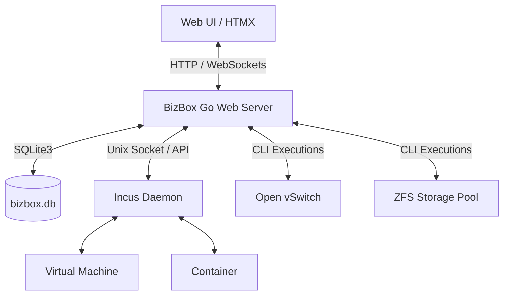

# BizBox Virtualization Hypervisor Blueprint

BizBox is a lightweight, self-hosted hypervisor and virtual machine manager designed for Debian/Ubuntu environments. It orchestrates Incus (LXD fork) for virtualization/containerization, Open vSwitch (OVS) for networking, and ZFS for rapid storage operations and snapshotting.

---

## 1. System Architecture



### Core Technologies
- **Backend**: Go (standard HTTP library + Gorilla Websockets + Incus client bindings)
- **Frontend**: Vanilla HTML/CSS with HTMX for dynamic, SPA-like interactions without heavyweight frameworks.
- **Database**: SQLite3 for system state, user accounts, audit logging, network segments, and QoS rules.
- **Hypervisor Engine**: Incus (running on local Unix Socket `/var/lib/incus/unix.socket`).
- **Networking**: Open vSwitch (OVS) for segment isolation, bridge management, and priority queues.
- **Storage**: ZFS storage pool (`rft`) for virtualization backing and fast snapshots.

---

## 2. Directory Structure

```
bizboxvirtual/
├── build-iso.sh           # Automated script to build a custom bootable installation ISO
├── BLUEPRINT.md           # Project architecture and technical design document
└── bizbox-mvp/
    ├── main.go            # Entrypoint, HTTP routes, VM lifecycle operations, middleware
    ├── auth.go            # Authentication, session timeout management, TOTP 2FA
    ├── network.go         # Open vSwitch integration and network segmentation
    ├── qos.go             # Traffic shaping and network Quality of Service (QoS)
    ├── security.go        # Port blocking, iptables rules, and host security settings
    ├── snapshot.go        # ZFS snapshot scheduler, listing, and rollback endpoints
    ├── updates.go         # Self-update manager over git/binary updates
    ├── go.mod / go.sum    # Go module dependency definitions
    ├── install.sh         # Linux installer script for direct node setup
    ├── templates/         # HTML template layouts (HTMX-ready fragments)
    │   ├── layout.html    # Core shell layout
    │   ├── dashboard.html # Instances list, stats, audit logs
    │   ├── vm-detail.html # VM management tabs (General, Snapshots timeline)
    │   ├── login.html     # Auth page
    │   └── ...            # Sub-pages (Network, QoS, Security, Settings, Wizard)
    └── static/
        ├── app.js         # Client-side helpers, websocket console interface, modal controls
        └── style.css      # Premium dark-themed dashboard stylesheet
```

---

## 3. Database Schema

BizBox utilizes a single SQLite database (`bizbox.db`) containing the following key tables:
- **`users`**: Manages admin user credentials (username, password hash, created date, session timeouts, and MFA/2FA secret keys).
- **`system_logs`**: Audit trail storing time-stamped administrator actions and task execution statuses.
- **`network_segments`**: Logical OVS network groups and associated VLAN tags.
- **`network_segment_vms`**: Relations linking specific VMs to network segments.
- **`qos_rules`**: Traffic prioritization and queue configurations mapped to segments/VMs.
- **`security_settings`**: Key-value store for active security controls (e.g. firewall active status).
- **`security_logs`**: Host security event occurrences.

---

## 4. Key Workflows

### Virtual Machine Lifecycle
1. User requests VM creation through the UI wizard.
2. Go backend calls Incus API via Unix socket (`c.CreateInstance`).
3. Incus pulls images dynamically (e.g., from `images.linuxcontainers.org`) and instantiates a `virtual-machine` instance type with configured CPU and memory limits.

### Automated Backups & ZFS Snapshots
1. A background scheduler (`StartAutoSnapshotScheduler`) polls active instances at regular intervals (default: every 15 minutes).
2. It takes native ZFS snapshots of the underlying dataset (`zfs snapshot rft/virtual-machines/vm@snap_xyz`).
3. The UI timeline (`vm-detail.html`) renders these snapshots as an interactive timeline, allowing administrative rollback (`zfs rollback`).

### Unattended Installation ISO
1. `build-iso.sh` pulls the latest official Ubuntu Server ISO.
2. Compiles the Go server binary for Linux.
3. Packages the binary, assets, and configurations into the ISO filesystem.
4. Generates an autoinstall config (`user-data`) using cloud-init to automate installation of OVS, ZFS, Incus, and the BizBox service during boot without user intervention.
