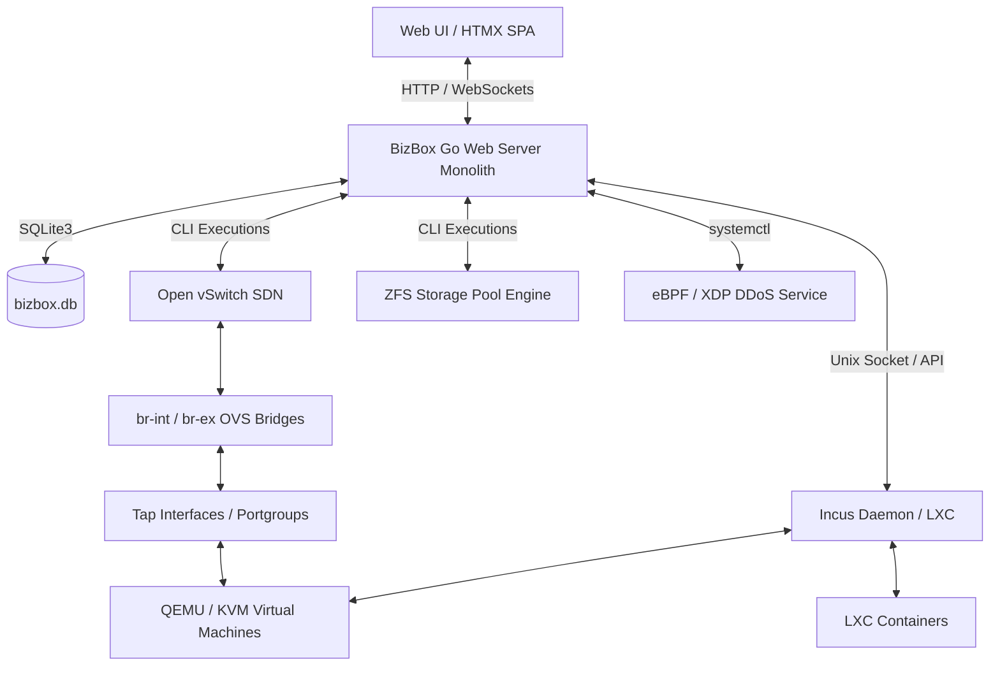

# BizBox Virtualization Appliance - Technical Blueprint & Architectural Specification

BizBox is an enterprise-grade, lightweight, self-hosted hypervisor management appliance and control plane designed for Linux (Debian/Ubuntu) environments. It orchestrates **Incus** (container & VM hypervisor daemon) for virtualization, **Open vSwitch (OVS)** for software-defined networking (SDN), **ZFS** for high-performance block storage and snapshotting, and **eBPF/XDP** for hardware-rate DDoS protection.

---

## 1. System Architecture



### Core Technology Stack
- **Backend Control Plane**: Go (net/http monolith, Gorilla WebSockets, Incus client API bindings).
- **Frontend Layer**: Vanilla HTML5/CSS3 (dark-mode design system) with **HTMX** for dynamic SPA-like interactivity without heavy JS frameworks.
- **Database Engine**: Embedded **SQLite3** (`bizbox.db`) handling user authentication, session state, audit logs, network segments, QoS rules, and security configurations.
- **Hypervisor Core**: Incus daemon interacting over Unix socket (`/var/lib/incus/unix.socket`).
- **Software-Defined Networking (SDN)**: Open vSwitch (OVS) for L2/L3 virtual bridge management, VLAN tagging, portgroups, and OpenFlow QoS rate limiting.
- **Storage Subsystem**: ZFS Storage Pools for raw disk management, dataset allocation, and sub-second COW snapshots.
- **Security & Ingress Protection**: eBPF / XDP (`xdp-ddos.service`) for line-rate packet filtering on physical NICs + sysctl bridge netfilter tuning.

---

## 2. Repository & Module Blueprint

```
bizboxvirtual/
├── 01-build-rootfs.sh      # Unattended Ubuntu live rootfs generation & package bootstrap
├── 02-build-live-iso.sh    # Live ISO bundler using SquashFS and xorriso
├── build-iso.sh            # Automated end-to-end bootable installer ISO generator
├── BLUEPRINT.md            # Comprehensive technical design blueprint & evaluation guide
└── bizbox-mvp/
    ├── main.go             # Server entrypoint ('serve' subcommand), HTTP router, Incus VM handlers, WS proxy
    ├── auth.go             # Authentication, session timeout management, bcrypt, TOTP 2FA, audit logs
    ├── network.go          # OVS integration, network segments (Portgroups), VLAN tagging, sysctl bridge isolation
    ├── uplink.go           # Physical NIC manager, default route management IF protection, DHCP/Static IP manager
    ├── storage.go          # Raw block device discovery (lsblk), zpool formatting, Incus storage pool registration
    ├── qos.go              # Traffic shaping, OpenFlow queue allocation, bandwidth limits
    ├── security.go         # eBPF/XDP DDoS protection service controller & security event logger
    ├── alerts.go           # Proactive alerting subsystem (Webhooks, Telegram Bot API, SMTP Email)
    ├── snapshot.go         # Automatic ZFS snapshot scheduler (15-min cron), retention pruning, 1-click rollback
    ├── updates.go          # Zero-downtime auto-update manager (Git pull, release tags, atomic build, health check, rollback)
    ├── install.sh          # Node installer script for direct Linux bare-metal deployment
    ├── templates/          # Embedded HTML templates (HTMX partial fragments)
    │   ├── layout.html     # Base SPA layout shell
    │   ├── dashboard.html  # System resource gauges, SVG sparkline metrics chart, audit logs
    │   ├── vm-detail.html  # VM detail tabs (General, Hardware, Snapshots timeline, Console)
    │   ├── storage.html    # Datastores & Unused Raw Disks manager
    │   ├── uplinks.html    # Physical NICs, vSwitch bindings & IP configuration
    │   ├── network.html    # OVS Portgroups & VLAN segment manager
    │   ├── security.html   # eBPF/XDP DDoS protection toggle & security audit trail
    │   └── settings.html   # Admin credentials, 2FA setup, Database Backup, Alert Settings, Update card
    └── static/
        ├── app.js          # HTMX event listeners, WebSocket terminal proxy, modal dialog handlers
        └── style.css       # Custom CSS design system (dark theme, glassmorphism, micro-animations)
```

---

## 3. Database Schema (`bizbox.db`)

1. **`users`**: `id`, `username`, `password_hash`, `role` (`admin`, `operator`, `viewer`), `two_factor_secret`, `two_factor_enabled`, `session_timeout`, `created_at`
2. **`system_logs`**: `id`, `timestamp`, `user`, `action`, `target`, `status`
3. **`network_segments`**: `id`, `name`, `vlan_id`, `vswitch_name`, `created_at`
4. **`network_segment_vms`**: `vm_name`, `segment_name` (Foreign key -> `network_segments.name`)
5. **`qos_rules`**: `id`, `segment_name`, `max_rate_mbps`, `burst_rate_mbps`, `created_at`
6. **`security_settings`**: `key` (PRIMARY KEY), `value`
7. **`security_logs`**: `id`, `timestamp`, `action`
8. **`alert_settings`**: `key` (PRIMARY KEY), `value` (Webhook URL, Telegram Token/Chat ID, SMTP settings)
9. **`login_attempts`**: `key` (PRIMARY KEY), `attempt_count`, `locked_until`, `updated_at`

---

## 4. Key Architectural Safeguards & Engineering Highlights

### A. Zero-Config TLS/HTTPS Encryption & Auto Redirect (`main.go`)
* **Transport Layer Security**: On first boot, `main.go` automatically generates self-signed TLS certificates (`config/cert.pem`, `config/key.pem`) using Go's `crypto/x509` and `crypto/rsa` if custom certificates are not supplied.
* **Encrypted API & Session Token Protection**: Serves HTTPS on port `8443` and automatically redirects plain HTTP traffic on port `8080` to `https://<host>:8443`, protecting login passwords, TOTP tokens, and session cookies from LAN eavesdropping.

### B. Persistent SQLite Rate-Limiting & Dual Lockout Policy (`auth.go`)
* **DB-backed State Persistence**: Failed attempts are stored in SQLite `login_attempts` table (`key`, `attempt_count`, `locked_until`). Restarting the service / binary auto-updates does **NOT** reset attempt counters or bypass lockouts.
* **Username Lockout Policy**: Scoped per user (`user:<username>`). 5 consecutive failed attempts lock that specific user account for 15 minutes without impacting other users.
* **NAT-Safe IP Protection Policy**: Scoped per client IP (`ip:<client_ip>`). To protect corporate networks behind shared NAT IPs from single-user lockouts, IP-level rate limiting uses a 20-attempt threshold before locking the IP.
* **Proactive Security Alerts**: Lockouts trigger an immediate notification dispatch (`SendAlert`) to Webhooks, Telegram, and Email via `alerts.go`.

### C. Role-Based Access Control (RBAC) (`auth.go` & `main.go`)
* **Multi-User Roles**: Supports `admin` (full management), `operator` (VM/Network ops), and `viewer` (read-only monitoring).

### D. L2 Bridge Isolation (`bridge-nf-call-iptables = 0`)
* **Problem**: In Linux kernels, if `net.bridge.bridge-nf-call-iptables` is enabled, host-level `iptables` / `netfilter` rules process L2 bridge frames (VM-to-VM traffic on OVS tap interfaces), causing unexpected packet drops or security log pollution.
* **Solution**: `network.go` enforces sysctl parameters programmatically at application startup (`tuneBridgeSysctl`), and `install.sh` / `01-build-rootfs.sh` persist `/etc/sysctl.d/99-bizbox-bridge.conf`:
  ```ini
  net.bridge.bridge-nf-call-iptables = 0
  net.bridge.bridge-nf-call-ip6tables = 0
  net.bridge.bridge-nf-call-arptables = 0
  ```

### E. Atomic Binary Swap, GPG Verification & Self-Healing Auto-Update (`updates.go`)
* **Release Tag Verification**: Auto-update fetches git tags (`git fetch --tags`) and verifies release tag integrity (`git tag -v`).
* **Control Plane Isolation**: Running QEMU/KVM VMs run inside independent Incus daemon processes. Updating the `bizbox-mvp` Go binary does **not** interrupt running VMs.
* **Atomic Compilation & Swap**: Updates compile the new version to a temporary binary (`go build -o bizbox-mvp.new`) and perform an atomic filesystem swap (`os.Rename`).
* **Automated Health Check & Rollback**: After updating, the system polls `GET /api/health`. If the health check fails to return `200 OK` within 5 seconds, `runSystemUpdate()` automatically restores `bizbox-mvp.bak`, restarts the service, and prevents control plane downtime.

### F. Physical Uplink & Host Management Protection (`uplink.go`)
* **Management NIC Auto-Detection**: Detects the interface holding the host's default gateway route (e.g. `eth0`).
* **Bridge Attachment Guard**: Prevents administrators from accidentally attaching the active management interface to an OVS bridge, avoiding host network lockouts.

### G. GFS (Grandfather-Father-Son) Tiered Snapshot Retention & Pruning (`snapshot.go`)
* **Background Scheduler**: `StartAutoSnapshotScheduler` polls instances every 15 minutes and creates native ZFS snapshots (`zfs snapshot rft/virtual-machines/vm@auto_timestamp`).
* **Multi-Tier GFS Pruning (`pruneGFSSnapshots`)**: Eliminates flat deletion data-loss risks by implementing a 3-tier GFS retention policy:
  1. **Son 24 Saat (Hourly Tier / Son)**: Keeps ALL automatic snapshots created within the last 24 hours.
  2. **Son 7 Gün (Daily Tier / Father)**: Keeps 1 snapshot per calendar day for snapshots between 24 hours and 7 days old.
  3. **Son 30 Gün / 4 Hafta (Weekly Tier / Grandfather)**: Keeps 1 snapshot per week for snapshots between 7 days and 30 days old.
  4. **> 30 Gün**: Automatic snapshots older than 30 days are pruned.
  5. **Manuel Snapshot Koruması**: User-created manual snapshots (`manual_*`) are strictly excluded from automated pruning and preserved indefinitely.

---

## 5. Guidelines for AI Software Evaluation

When reviewing this codebase for software quality, architecture, and security, evaluate the following dimensions:

1. **Separation of Concerns & Architecture**:
   - Is the Go control plane cleanly decoupled from hypervisor and SDN drivers?
   - How well does the HTMX template rendering eliminate unnecessary JavaScript build pipelines while maintaining responsive UX?
2. **Resilience & Fault Tolerance**:
   - Does the auto-update mechanism handle partial compilation failures and process crashes gracefully?
   - Are hypervisor operations (Incus Unix socket) properly isolated from host management networking?
3. **Security & Hardening**:
   - Are password hashing (bcrypt), TOTP 2FA, session timeouts, and audit trails correctly implemented?
   - Is host network ingress (eBPF/XDP) properly segregated from internal VM-to-VM L2 SDN traffic?
4. **Performance & Resource Overhead**:
   - Evaluate memory footprint and startup performance of the Go monolith compared to alternative hypervisor management stacks (e.g. Proxmox, OpenStack).
5. **Code Maintainability**:
   - Is error handling explicit across system commands (`exec.Command`) and database queries?
